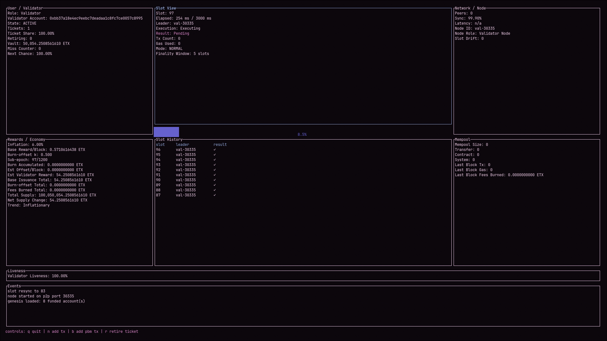

# Eternix Testnet

  

This repository contains the early 0.x implementation of an Eternix testnet node written in Rust.

Eternix is a Layer-1 blockchain built around deterministic execution, irreversible consensus weight, and explicit monetary policy.

It implements a deterministic slot engine with PoAsh-style ticket-based leader selection, protocol-generated fallback blocks, fee burn accounting, sub-epoch/epoch boundaries, and a terminal UI dashboard.

---

> [!WARNING]
> This is an early 0.x testnet prototype intended for protocol experimentation.
> Consensus rules, RPC methods, transaction formats, and validator mechanics may change without notice.
> Do not use with real funds.

## Current Status

Implemented:

- Slot engine
- Validator selection
- RPC
- Basic P2P gossip
- Mempool
- Protocol blocks

In progress:

- Internet networking
- Full signature validation
- Persistent database
- XVM integration
- Improved Ethereum wallet compatibility (experimental)

Planned:

- FCTs
- Wallet software
- Explorer

## Implemented Protocol Areas

- 3-second slots with 2100ms leader deadline behavior
- Sub-epoch (1200 slots) and epoch (24 sub-epochs) boundaries
- Ticket-weighted bucket selection and deterministic scoring
- Same-slot collision neutralization to protocol block
- Protocol block fallback for missed leader and no eligible tickets
- Separate PBM queue with delayed validity and deterministic inclusion
- Fee burning and burn-offset accumulator accounting
- Basic validator miss/offense tracking and state transitions
- Hard-finality window surfaced in UI

## Node TUI

The TUI follows the design layout:

- Top row: validator panel, slot view, network/node panel
- Bottom row: rewards/economy, slot history, mempool panel
- Liveness bar
- Events panel

Controls:

- `q`: quit
- `n`: add standard mempool transaction
- `b`: add PBM transaction

## Screenshot



## Requirements

- Rust stable toolchain
- Cargo

Install:

```bash
curl https://sh.rustup.rs -sSf | sh
```

## Run

```bash
cargo run
```

Start as a validator node on custom port:

```bash
cargo run -- --mode validator --p2p-port 30333
```

Start as a validator with an explicit owner account:

```bash
cargo run -- --mode validator --p2p-port 30333 --validator-account 0xYOUR_ADDRESS
```

Run with custom RPC port:

```bash
cargo run -- --mode validator --p2p-port 30333 --rpc-port 8545
```

Run with a custom genesis file:

```bash
cargo run -- --genesis ./genesis.json
```

Validator startup behavior for this prototype:

- No validators are preloaded in genesis.
- Starting a validator node auto-registers one validator ID (`val-<p2p-port>`).
- `--validator-account` binds an account address as the owner account for that validator.
- `buy_ticket` takes `validator_id` and burns ETX from the validator's configured owner account.
- `wallet_to_vault` and `vault_to_wallet` take `validator_id` and move ETX between the validator's configured owner account and vault.
- It is auto-provisioned with:
  - 1 ticket
  - 50,000 ETX vault (stored in quarks internally)

## Genesis

Startup account allocations are loaded from `genesis.json` by default.

Each account entry may use either `private_key_hex` or `address`. Accounts with `private_key_hex` are available through `eth_accounts`; address-only accounts are funded but do not have a local private key.

Balances are keyed by token ID. Token `"0"` is ETX.

Example:

```json
{
  "accounts": [
    {
      "id": "acct-1",
      "private_key_hex": "0x...",
      "balances": {
        "0": "10000000000000"
      }
    },
    {
      "address": "0x1111111111111111111111111111111111111111",
      "balances": {
        "0": "50000000000000"
      }
    }
  ]
}
```

Use string values for large balance amounts to avoid JSON number precision limits in external tooling.

Start as a standard node and connect to a peer:

```bash
cargo run -- --mode standard --p2p-port 30334 --peers 127.0.0.1:30333
```

Multiple peers can be passed as comma-separated `host:port` entries.

## RPC (HTTP JSON)

RPC listens on `127.0.0.1:<rpc-port>` (default `8545`) and accepts `POST /` with JSON body:

```json
{"method":"send_tx","params":{"chain_id":1162,"from":"0x...","nonce":1,"to":"0x...","value":1000,"gas_limit":1000,"max_fee_per_gas":10,"data":"","tx_type":"normal_transfer"}}
```

Supported methods:

- `list_accounts` `{}`
- `create_account` `{ account_id? }`
- `import_private_key` `{ private_key_hex, account_id? }`
- `etx_faucet` `{ to, amount_quarks? }`
- `send_tx` `{ chain_id, from, nonce, to, token_id?, value, gas_limit, max_fee_per_gas, fee_token_id?, data, tx_type, signature? }`
- `buy_ticket` `{ validator_id, count? }`
- `wallet_to_vault` `{ validator_id, amount_quarks }`
- `vault_to_wallet` `{ validator_id, amount_quarks }`
- `get_account` `{ account_id }`

Example:

```bash
curl -s -X POST http://127.0.0.1:8545/ -H 'content-type: application/json' -d '{"method":"list_accounts","params":{}}'
curl -s -X POST http://127.0.0.1:8545/ -H 'content-type: application/json' -d '{"method":"create_account","params":{"account_id":"alice"}}'
curl -s -X POST http://127.0.0.1:8545/ -H 'content-type: application/json' -d '{"method":"import_private_key","params":{"account_id":"my-eth","private_key_hex":"0xYOUR_PRIVATE_KEY"}}'
curl -s -X POST http://127.0.0.1:8545/ -H 'content-type: application/json' -d '{"method":"etx_faucet","params":{"to":"0xYOUR_ADDRESS","amount_quarks":10000000000000}}'
curl -s -X POST http://127.0.0.1:8545/ -H 'content-type: application/json' -d '{"method":"etx_faucet","params":{"to":"0xYOUR_ADDRESS","amount_quarks":"100000000000000000000"}}'
curl -s -X POST http://127.0.0.1:8545/ -H 'content-type: application/json' -d '{"method":"get_account","params":{"account_id":"0x..."}}'
curl -s -X POST http://127.0.0.1:8545/ -H 'content-type: application/json' -d '{"method":"send_tx","params":{"chain_id":1162,"from":"0x1111111111111111111111111111111111111111","nonce":1,"to":"0x2222222222222222222222222222222222222222","value":1000,"gas_limit":1000,"max_fee_per_gas":10,"data":"","tx_type":"normal_transfer"}}'
```

## Quickstart

### Start validator

```bash
cargo run -- --mode validator --p2p-port 30333 --rpc-port 8545
```

### Create account

```bash 
curl -s -X POST http://127.0.0.1:8545/ -H 'content-type: application/json' -d '{"method":"create_account","params":{"account_id":"alice"}}'
```

### Get faucet funds

```bash
curl -s -X POST http://127.0.0.1:8545/ -H 'content-type: application/json' -d '{"method":"etx_faucet","params":{"to":"0xYOUR_ADDRESS","amount_quarks":10000000000000}}'
```

### Send transaction

```bash
curl -s -X POST http://127.0.0.1:8545/ -H 'content-type: application/json' -d '{"method":"send_tx","params":{"chain_id":1162,"from":"0xYOUR_ADDRESS","nonce":1,"to":"0xRECIPIENT_ADDRESS","value":1000,"gas_limit":1000,"max_fee_per_gas":10,"data":"","tx_type":"normal_transfer"}}'
```

## Notes

- This is a testnet prototype focused on protocol mechanics and observability.
- P2P networking, full EVM execution, persistent state DB, and cryptographic transaction validation are not fully implemented in this version.
- P2P in this version is UDP-based gossip for peer hello and transaction propagation (mempool sync).
- Hello gossip is sent immediately at boot and then every 500ms to reduce peer-discovery delay.
- On startup, a node performs one-time slot bootstrap from peers (`slot` + `slot-start timestamp`) so late joiners align to current network slot.
- Validator discovery is propagated via hello metadata; validator nodes are added to the local validator registry with one deterministic ticket.
- Tested on:
  - Linux (Arch)
  - Windows: Untested
  - macOS: Untested

## Documentation

Protocol specifications and docs will be published at:

https://docs.eternix.dev

(Currently under construction.)

## License

MIT
